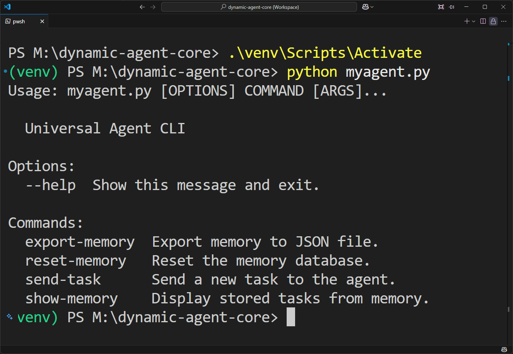

# 🧠 Dynamic Agent Core

> A modular and extensible framework for building AI-powered agents with task memory and tool-based execution logic.

---

## 🚀 Overview

**Dynamic Agent Core** is a lightweight Python framework for crafting intelligent agents capable of:
- Receiving and analyzing tasks via CLI.
- Selecting tools dynamically based on task keywords.
- Executing actions and storing results.
- Managing a persistent memory of past tasks using SQLite.

Built with scalability and extensibility in mind, the framework is ideal for rapid prototyping or building intelligent automation workflows.

---

## 🧩 Features

- ✅ Modular agent design (`Agent`, `Analyzer`, `Memory`, `Tools`)
- 🧠 Persistent memory using SQLite
- 🔌 Easily extendable with custom tools
- 🖥️ Command-Line Interface using `Click`
- 💾 Export and reset task memory
- ⚡ Simple tool mapping logic

---

## 📁 Project Structure

```
agentcrafter-dynamic-agent-core/
├── agent/               # Core agent logic (base, analyzer)
├── memory/              # SQLite memory interface
├── tools/               # Built-in tools (file operations, email, etc.)
├── config/              # Configuration settings
├── myagent.py           # Main CLI entry point
├── requirements.txt     # Python dependencies
├── LICENSE              # Apache 2.0 License
└── README.md            # This file
```

---

## 🔧 Installation

```bash
# Clone the repository
git clone https://github.com/yourusername/agentcrafter-dynamic-agent-core.git
cd agentcrafter-dynamic-agent-core

# Create a virtual environment (optional)
python -m venv venv
source venv/bin/activate  # or venv\Scripts\activate on Windows

# Install dependencies
pip install -r requirements.txt
```

---

## 🕹️ Usage

Run the CLI tool with:

```bash
python myagent.py [COMMAND]
```

### Available Commands

| Command           | Description                             |
|------------------|-----------------------------------------|
| `send-task`       | Send a new task to the agent            |
| `show-memory`     | Display all stored tasks                |
| `reset-memory`    | Delete memory database and restart      |
| `export-memory`   | Export memory to a JSON file            |

---

## 🧠 Example

```bash
# Send a task
python myagent.py send-task "Copy report file"

# Show memory
python myagent.py show-memory

# Export memory to file
python myagent.py export-memory --output exported.json
```

---

## 📸 Screenshot



---

## 🛠️ Adding New Tools

You can easily extend functionality by adding new tools to `tools/` and updating the `tool_map` in `analyzer.py`.

```python
# tools/emailer.py
def send_email(task):
    return "Email sent!"

# analyzer.py
tool_map = {
    "email": send_email,
    "copy": copy_file,
}
```

---

## 📜 License

This project is licensed under the [Apache License 2.0](LICENSE).

---

## 👨‍💻 Author

Crafted by **[AgentCrafter](https://github.com/yourusername)** — Contributions welcome!